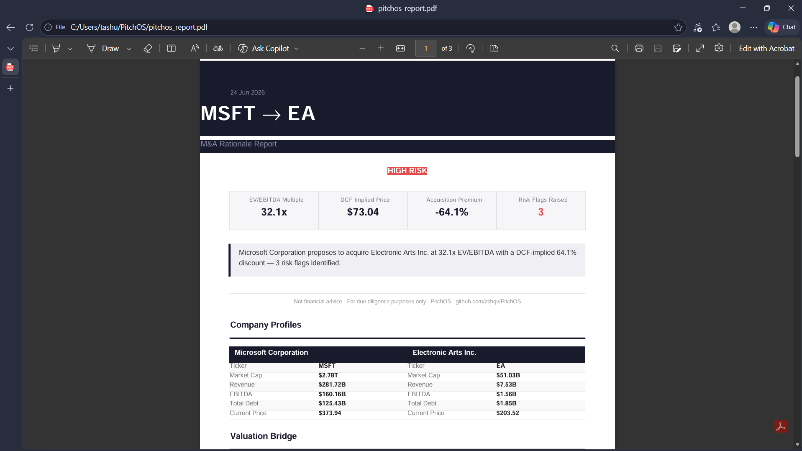

# PitchOS

PitchOS -- Automated M&A rationale generator. Takes two tickers, outputs a one-page deal brief.

## Preview


---

## Ecosystem

| Tool | What it does | GitHub |
|------|-------------|--------|
| **Trikosh** | Stock screener -- filters tickers by fundamental criteria | [zshqv/Trikosh](https://github.com/zshqv/Trikosh) |
| **RedFlag** | Risk signal detector -- flags anomalies in financial statements | [zshqv/RedFlag](https://github.com/zshqv/RedFlag) |
| **BriefOS** | Company research brief generator -- one-click PDF from a single ticker | [zshqv/BriefOS](https://github.com/zshqv/BriefOS) |
| **PitchOS** | M&A rationale generator -- DCF + risk flags + PDF from two tickers | [zshqv/PitchOS](https://github.com/zshqv/PitchOS) |

---

## Installation

```bash
pip install -r requirements.txt
```

## Usage

```bash
python main.py --acquirer MSFT --target EA --output msft_ea_pitch.pdf
```

| Argument | Required | Default | Description |
|----------|----------|---------|-------------|
| `--acquirer` | Yes | -- | Acquirer ticker symbol (e.g. `MSFT`) |
| `--target` | Yes | -- | Target ticker symbol (e.g. `EA`) |
| `--output` | No | `pitchos_report.pdf` | Output PDF filename |

---

## What it outputs

The generated PDF contains five structured sections:

1. **Company Snapshots** -- Side-by-side financial profile for acquirer and target (market cap, revenue, EBITDA, debt, current price)
2. **Valuation Bridge** -- EV/EBITDA multiples for both companies with deal-pricing commentary
3. **DCF Summary** -- Five-year free cash flow projection, terminal value, implied share price, and acquisition premium
4. **M&A Rationale Summary** -- Plain-English four-sentence deal summary with analyst recommendation
5. **Automated Deal Risk Flags** -- Up to six algorithmically generated risk signals with amber bullet indicators

---

## Assumptions

All DCF and valuation inputs are centralised in [`config/assumptions.py`](config/assumptions.py).
Edit that file to override defaults -- no other file needs to change.

| Parameter | Default | What it controls |
|-----------|---------|-----------------|
| `revenue_growth_rate` | `0.05` (5%) | Year-over-year top-line growth applied across the projection period |
| `ebitda_margin` | `0.20` (20%) | EBITDA as a fraction of revenue; used to derive projected FCF |
| `wacc` | `0.09` (9%) | Discount rate applied to all projected cash flows and the terminal value |
| `terminal_growth_rate` | `0.025` (2.5%) | Perpetuity growth rate in the Gordon Growth Model terminal value; should not exceed long-run nominal GDP growth |
| `projection_years` | `5` | Number of explicit forecast years before the terminal value |

---

## Limitations

- **Free-tier data only.** All financials are sourced from Yahoo Finance via yfinance. Coverage gaps (missing fields, stale data) are handled gracefully with `None` fallbacks and "N/A" in the PDF.
- **No synergy modelling.** The DCF projects the target on a standalone basis. Cost or revenue synergies are not modelled -- analysts should layer these on top of the implied price manually.
- **Simplified FCF proxy.** Free cash flow is estimated as EBITDA x 0.65 (a blended after-tax approximation). This avoids requiring capex and working-capital schedules but will differ from a full financial model.
- **Delisted securities.** Tickers that are no longer publicly traded (e.g. post-acquisition) will return no data from yfinance and cause a graceful exit with a clear error message.
